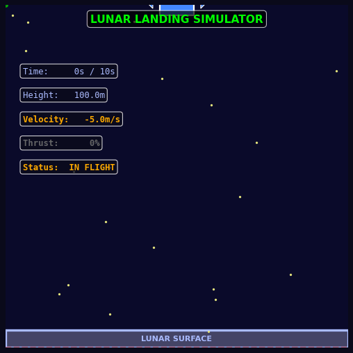
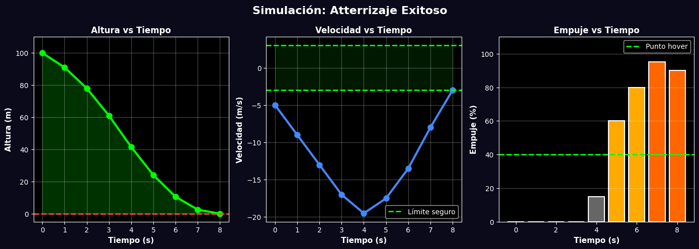
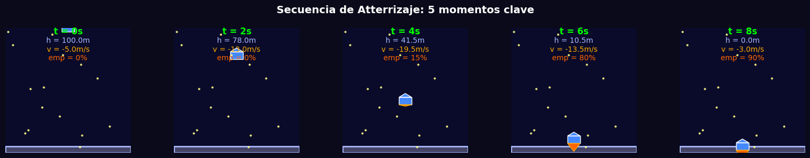
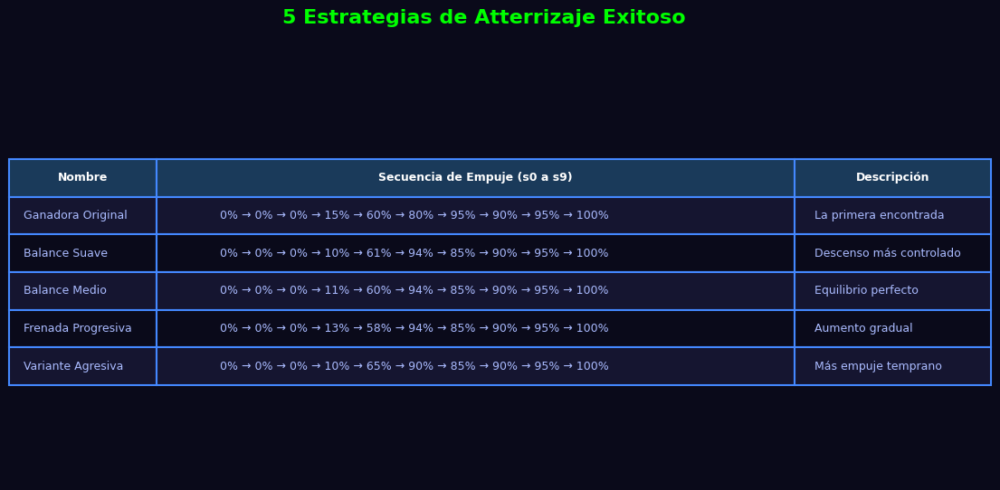

# Aterrizaje Lunar — Simulador de Algoritmos

Una herramienta educativa interactiva para enseñar algoritmos como "secuencia predefinida de instrucciones".

Los estudiantes arrastran **10 sliders** para configurar el empuje de una nave espacial segundo a segundo y la ven aterrizar (o estrellarse) en tiempo real.

---

## Vista Previa

### Animación de aterrizaje exitoso



---

### Gráficas de simulación



Las tres métricas clave de una simulación completa:
- **Izquierda:** Altura desciende de 100 m a 0 m
- **Centro:** Velocidad controlada para llegar a −3 m/s en el aterrizaje
- **Derecha:** Secuencia de empujes aplicados segundo a segundo

---

### Secuencia visual de aterrizaje



Los 5 momentos clave del descenso: caída libre, inicio de frenada y aterrizaje suave.

---

### Estrategias ganadoras de referencia



Cinco secuencias que logran aterrizaje exitoso — úsalas como punto de partida o desafío.

---

## Instalación y Ejecución

### Requisitos

- Python 3.11+
- `uv` (manejador de paquetes moderno)

### Pasos

```bash
# Clonar el repositorio
git clone https://github.com/AndresInsuasty/landing-or-not.git
cd landing-or-not

# Ejecutar (uv instala las dependencias automáticamente)
uv run run.py
```

---

## Estructura del Proyecto

```
landing-or-not/
├── src/
│   ├── physics.py              # Motor de simulación puro (sin pygame)
│   └── main.py                 # Aplicación pygame con 3 pantallas
├── scripts/
│   ├── generate_demo_images.py # Genera imágenes demostrativas
│   ├── generate_landing_gif.py # Genera GIF animado
│   └── secuencias_exitosas.txt # Listado de estrategias ganadoras
├── img/
│   ├── demo_graphs.png         # Gráficos de simulación
│   ├── demo_sequence.png       # Secuencia visual de aterrizaje
│   ├── demo_strategies.png     # Tabla de estrategias
│   └── landing_animation.gif   # Animación GIF del aterrizaje
├── run.py                      # Entry point
├── pyproject.toml              # Configuración uv
├── CLAUDE.md                   # Guía para Claude Code
└── README.md                   # Este archivo
```

---

## Cómo Usar

### 1. Pantalla de Entrada

- Arrastra los **10 sliders** para configurar el empuje de cada segundo (0–100%)
- Usa ← → para ajuste fino de ±5 % · Shift + ← → para ±1 %
- **Clave:** Empuje al **40 %** cancela la gravedad (hover perfecto)
- Haz clic en **SIMULAR** para ejecutar tu algoritmo

### 2. Simulación

- Observa la nave animada descendiendo con llamas reactivas
- Panel izquierdo muestra telemetría en tiempo real: altura, velocidad, empuje
- Barra de progreso de tiempo en la parte superior (10 segmentos)
- Duración: ~1.5 s de animación por segundo simulado

### 3. Resultados

Tres posibles resultados:

| Resultado | Condición | Color |
|-----------|-----------|-------|
| **ATERRIZAJE EXITOSO** | `\|v\|` ≤ 3 m/s al tocar suelo | Verde |
| **CHOQUE — NAVE DESTRUIDA** | `\|v\|` > 3 m/s al tocar suelo | Rojo |
| **SIN ATERRIZAJE** | Altura > 0 m después de 10 s | Amarillo |

Haz clic en **INTENTAR DE NUEVO** para probar otra estrategia.

---

## Fisica del Simulador

### Constantes Globales

- Altura inicial: 100 m
- Velocidad inicial: -5 m/s (cayendo)
- Gravedad: 4 m/s² hacia abajo
- Empuje maximo: 10 m/s² hacia arriba (al 100%)
- Punto de equilibrio (hover): ~40% de empuje
- Criterio de exito: Altura <= 0 m Y |v| <= 3 m/s

### Ecuacion de Movimiento (cada segundo)

```
aceleracion_neta = (empuje% / 100) * 10 - 4
velocidad_nueva = velocidad_anterior + aceleracion_neta
altura_nueva = altura_anterior + velocidad_nueva
```

### Por que 40% es especial

Si empuje = 40%:
- Net acceleration = (40/100) * 10 - 4 = 4 - 4 = 0
- Aceleracion neta = 0 → velocidad NO cambia (hover perfecto)

---

## ESTRATEGIAS DE ATTERRIZAJE EXITOSO

Se encontraron 10+ estrategias diferentes que logran atterrizaje exitoso.
Aqui estan 5 para que los estudiantes prueben:

---

### ESTRATEGIA 1: Ganadora Original

```
Segundo  1  2  3  4  5  6  7  8  9 10
Empuje % 0  0  0 15 60 80 95 90 95 100
```

**Simulacion paso a paso:**
```
t=0  h=100.0m  v= -5.0m/s  emp= 0%
t=1  h= 91.0m  v= -9.0m/s  emp= 0%   <- Acelerando hacia abajo
t=2  h= 78.0m  v=-13.0m/s  emp= 0%
t=3  h= 61.0m  v=-17.0m/s  emp= 0%   <- Velocidad maxima (-17 m/s)
t=4  h= 41.5m  v=-19.5m/s  emp=15%   <- Inicia frenada suave
t=5  h= 24.0m  v=-17.5m/s  emp=60%   <- Aumenta frenada significativamente
t=6  h= 10.5m  v=-13.5m/s  emp=80%   <- Sigue frenando
t=7  h=  2.5m  v= -8.0m/s  emp=95%   <- Frenada casi maxima
t=8  h=  0.0m  v= -3.0m/s  emp=90%   <- EXITO! Velocidad perfecta
```

**Caracteristicas:**
- Caida libre los primeros 3 segundos
- Frenada gradual desde t=4
- Atterrizaje a -3.0 m/s en t=8 (dentro del limite)

---

### ESTRATEGIA 2: Balance Suave

```
Segundo  1  2  3  4  5  6  7  8  9 10
Empuje % 0  0  0 10 61 94 85 90 95 100
```

**Caracteristicas:**
- Descenso un poco menos agresivo (empuje en t=4 es 10% vs 15%)
- Mas frenada temprana (t=5 es 61% vs 60%)
- Tambien atterriza a -3.0 m/s en t=8

---

### ESTRATEGIA 3: Balance Perfecto

```
Segundo  1  2  3  4  5  6  7  8  9 10
Empuje % 0  0  0 11 60 94 85 90 95 100
```

**Caracteristicas:**
- Pequeno empuje en t=4 (11%)
- Maximo empuje en t=6 (94% vs 80%)
- Atterrizaje suave y predecible

---

### ESTRATEGIA 4: Frenada Progresiva

```
Segundo  1  2  3  4  5  6  7  8  9 10
Empuje % 0  0  0 13 58 94 85 90 95 100
```

**Caracteristicas:**
- Empuje mas bajo en t=4 (13%)
- Compensado con empuje en t=5 (58%)
- Frenada muy suave y controlada

---

### ESTRATEGIA 5: Variante Agresiva

```
Segundo  1  2  3  4  5  6  7  8  9 10
Empuje % 0  0  0 10 65 90 85 90 95 100
```

**Caracteristicas:**
- Empuje minimo en t=4 (10%)
- Compensado con empuje maximo en t=5 (65%)
- Requiere frenada mas fuerte al final

---

## Desafios para Estudiantes

### Nivel 1: Principiante
Usa una de las 5 estrategias exitosas tal cual esta. Observa que sucede.

### Nivel 2: Intermedio
Cambia UNO de los valores de las estrategias existentes. Sigue aterrizando? A que velocidad?

### Nivel 3: Avanzado
Diseña tu propia estrategia desde cero. Prueba diferentes distribuciones.

### Reto Extremo
Encuentra una estrategia que atterrice con velocidad EXACTAMENTE igual a -2.0 m/s
(mas preciso que -3.0 m/s).

---

## Estructura del Codigo

### src/physics.py — Motor de Simulacion Puro

Sin dependencias externas:

```python
simulate(thrusts: list[float]) -> list[dict]
  Entrada: lista de 10 valores de empuje (0-100%)
  Salida: lista de 11 estados (inicial + uno por cada segundo)
  Cada estado contiene: t, h, v, thrust, net_accel, outcome

classify_outcome(states: list[dict]) -> str
  Retorna: "EXITO", "CHOQUE", o "SIN_ATTERRIZAJE"
```

### src/main.py — Aplicación Pygame

Tres pantallas con máquina de estados:

1. **InputScreen**: 10 sliders arrastrables con previsualización en tiempo real
2. **SimulationScreen**: Animación 60 FPS con telemetría, grid de altitud y barra de tiempo
3. **ResultScreen**: Panel de resultados con barras de empuje y mensaje educativo

---

## Scripts Utiles

Los scripts en la carpeta `scripts/` pueden ejecutarse independientemente para regenerar imagenes y GIFs:

```bash
# Regenerar imagenes demostrativas
uv run scripts/generate_demo_images.py

# Regenerar GIF animado
uv run scripts/generate_landing_gif.py
```

---

## Para Docentes: Valor Pedagogico

Esta herramienta enseña:

**ALGORITMOS COMO SECUENCIA PREDEFINIDA**
- Los estudiantes preparan un "plan" (algoritmo) antes de ejecutarlo
- Refuerza la idea de que los algoritmos son instrucciones secuenciales

**PENSAMIENTO COMPUTACIONAL**
- Necesitan razonar sobre causa y efecto
- Empuje → Aceleracion → Velocidad → Altura
- Desarrollo de intuicion fisica-computacional

**OPTIMIZACION**
- Existen multiples soluciones; NO hay una unica respuesta correcta
- Hay trade-offs: diferentes estrategias tienen distintas caracteristicas
- Oportunidad de comparar y analizar soluciones

**PRUEBA Y ERROR ITERATIVO**
- Refuerza el ciclo: Predecir → Simular → Analizar → Ajustar
- Feedback visual inmediato
- Motivacion intrinseca (resolver el "puzzle")

### Actividades Sugeridas en Clase

1. **Fase 1 - Prediccion:**
   - Distribuir una estrategia en papel
   - Pedir a los estudiantes: "Que creen que pasara?"
   - Registrar predicciones

2. **Fase 2 - Simulacion:**
   - Ejecutar la estrategia
   - Comparar resultado real vs prediccion

3. **Fase 3 - Analisis:**
   - Mostrar graficos de altura/velocidad/empuje
   - Preguntar: "Donde ocurrio el cambio mayor?"

4. **Fase 4 - Iteracion:**
   - Pedir ajustes pequenos: "Que pasa si subes 10% en t=5?"
   - Fomentar experimentacion

5. **Fase 5 - Reto Colaborativo:**
   - Competencia: Quien consigue velocidad de atterrizaje mas cercana a 0?
   - Documentacion: Escribir estrategia ganadora y explicar razonamiento

---

## Ejemplos de Estrategias Fallidas (Para Analisis)

### CRASH CLASICO: Sin empuje

```
[0, 0, 0, 0, 0, 0, 0, 0, 0, 0]
```
Resultado: Caida libre → CHOQUE a -29.0 m/s

### SIN ATTERRIZAJE: Demasiado empuje

```
[50, 50, 50, 50, 50, 50, 50, 50, 50, 50]
```
Resultado: Desciende lentamente pero se queda en el aire

---

## Tecnologias Utilizadas

- **Python 3.11+** - Lenguaje de programacion
- **pygame** - Para la interfaz grafica y animaciones
- **matplotlib** - Para graficos y visualizaciones
- **Pillow** - Para procesamiento de imagenes y generacion de GIFs
- **uv** - Manejador moderno de paquetes Python

---

## Soporte y Contribuciones

Para dudas, sugerencias o reportar problemas:
1. Verifica que tienes Python 3.11+
2. Asegúrate de haber instalado todas las dependencias con `uv add pygame matplotlib`
3. Intenta con una de las 5 estrategias exitosas del README

---

## Licencia

Creado para fines educativos. Libre para usar, modificar y compartir.

---

**Buena suerte, a atterrizar! Saludos.** 🚀🌙
